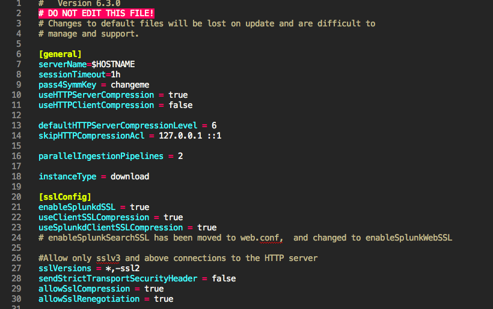

# Sublime Text syntax highlighting for .conf files

Sublime Text is awesome! But, there's no great way to get syntax highlighting for a .conf file... until now!

*Only tested on Sublime Text 3**

## Installation

* Clone the repo
* `cd sublime-splunk-conf-highlighting`
* `cp splunk-conf.tmLanguage ~/Library/Application\ Support/Sublime\ Text\ 3/Packages/user/splunk-conf.tmLanguage`
* Open Sublime and gogogo!

## Patterns

Patterns are used to identify some part of a file.

Patterns have 3 main attributes:

* `match` (or `begin` and `end`): regex patterns
* `name`: a `TextMate` language grammar group, `comment.line` for an inline comment
* `comment`: a comment about the pattern

## Resources

* This TextMate [Language Grammars guide](https://manual.macromates.com/en/language_grammars#naming_conventions) is really helpful for figuring out what name to use for each rule.

## Development Notes

There are 2 important files here:

* `splunk-conf.json` - The `AAAPackageDev` package compiles this to the following, this JSON file is much easier to use
* `splunk-conf.tmLanguage` - This is a TextMate language definition file in XML format. SublimeText uses this format, it's a necessary evil.

* Install package control if you haven't already
* cmd + shift + P (Mac) or ctrl + shift + P (Windows)
    - Install package
    - AAAPackageDev
* Open `splunk-conf.JSON`
* cmd + B should update `splunk-conf.tmLanguage`, make a small change and see if it worked. If not, play with your build system settings under Tools -> Build System
* During development you'll need to constantly copy the `splunk-conf.tmLanguage` into your Sublime Text package folder, like so: `cp splunk-conf.tmLanguage ~/Library/Application\ Support/Sublime\ Text\ 3/Packages/user/splunk-conf.tmLanguage`
* If something doesn't seem to update, quit & reopen Sublime Text and it should work.