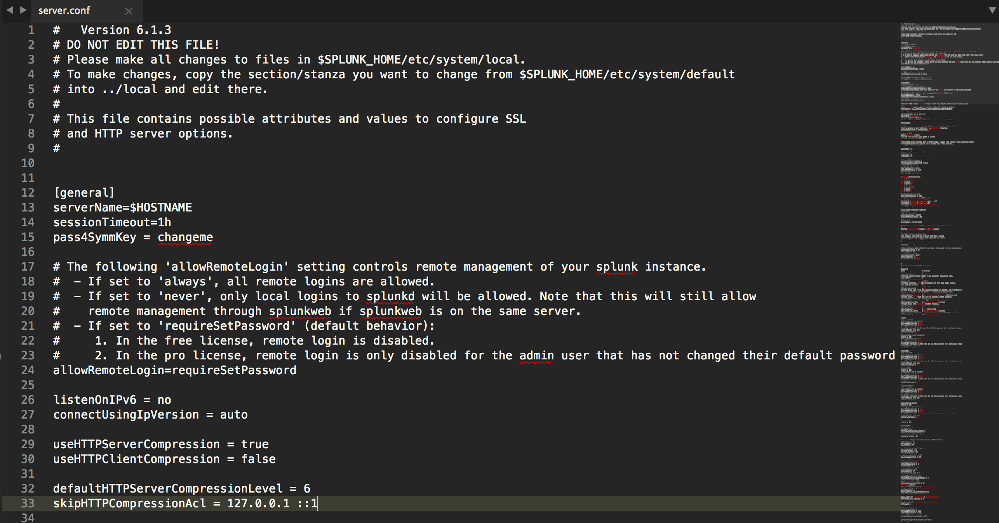
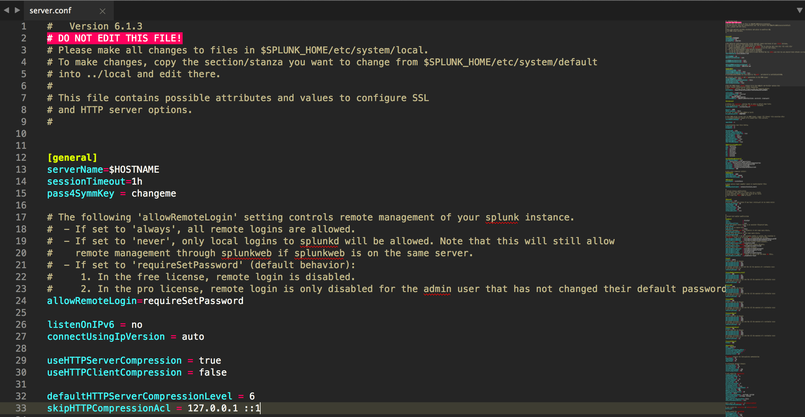

# Sublime Text syntax highlighting for .conf files

Sublime Text is awesome! But, there's no great way to get syntax highlighting for a Splunk .conf file... until now!

**It works with Sublime Text 2 & 3!**

### Before

### After

## Installation

* Install it from [Package Control](https://packagecontrol.io/) - search for `Splunk Conf File Syntax Highlighting`

 
### Manual Installation

* Clone the repo
* `cd sublime-splunk-conf-highlighting`

#### Sublime Text 2

* `cp splunk-conf.tmLanguage ~/Library/Application\ Support/Sublime\ Text\ 2/Packages/user/splunk-conf.tmLanguage`

#### Sublime Text 3

* `cp splunk-conf.tmLanguage ~/Library/Application\ Support/Sublime\ Text\ 3/Packages/user/splunk-conf.tmLanguage`

## Patterns

Patterns are used to identify some part of a file.

Patterns used by this package:

* `^# DO NOT EDIT THIS FILE\\!$` - marks any lines as invalid if they are `# DO NOT EDIT THIS FILE!`
* `^#.*$` - marks any lines that start with `#` as a comment
* `^\\[.*\\]$` - marks any line starting with `[` and ending with `]` as a stanza
* `^[\\w+\\.\\-\\:]+` - marks the beginning of a line as a conf key; defined by any whitespace, alphanumeric, `-` or `:` characters
* `=` - marks any `=` as an equals sign

Patterns have 3 main attributes:

* `match` (or, `begin` and `end`): regex patterns
* `name`: a `TextMate` language grammar group, `comment.line` for an inline comment
* `comment`: a comment about the pattern

## Resources

* This TextMate [Language Grammars guide](https://manual.macromates.com/en/language_grammars#naming_conventions) is really helpful for figuring out what name to use for each rule.

## Development Notes

There are 2 important files here:

* `splunk-conf.json` - The `PackageDev` package compiles this to the following, this JSON file is much easier to use
* `splunk-conf.tmLanguage` - This is a TextMate language definition file in XML format. SublimeText uses this format, it's a necessary evil.

* Install package control if you haven't already
* cmd + shift + P (Mac) or ctrl + shift + P (Windows)
    - Install package
    - PackageDev
* Open `splunk-conf.JSON`
* cmd + B should update `splunk-conf.tmLanguage`, make a small change and see if it worked. If not, play with your build system settings under Tools -> Build System
* During development you'll need to constantly copy the `splunk-conf.tmLanguage` into your Sublime Text package folder, like so: `cp splunk-conf.tmLanguage ~/Library/Application\ Support/Sublime\ Text\ 3/Packages/user/splunk-conf.tmLanguage`
* If something doesn't seem to update, quit & reopen Sublime Text and it should work.
